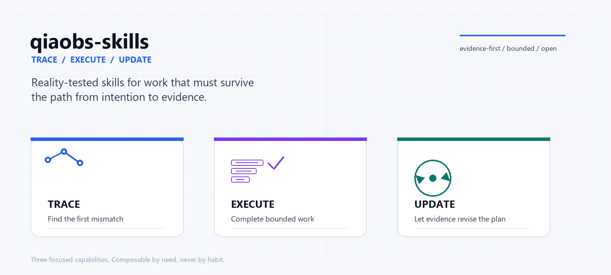

<picture>
  <source media="(prefers-color-scheme: dark)" srcset="assets/hero-dark.png">
  <source media="(prefers-color-scheme: light)" srcset="assets/hero-light.png">
  
</picture>

# qiaobs-skills

**Three reality-tested Agent Skills to trace the first mismatch, finish bounded work with fewer handoffs, and update decisions from evidence.**

[简体中文](README.md) · [Quick install](#quick-install) · [Choose a Skill](#which-skill-do-i-need) · [Case study](#an-anonymized-case)

[](https://github.com/qiao-obs/qiaobs-skills/actions/workflows/validate.yml)
[](LICENSE)
[](https://agentskills.io/)

## Understand it in 30 seconds

Many agent tasks fail not because the agent cannot write code, but because it **stops before following reality through the path that actually matters**:

- a feature fails only for one role, device, entry point, or non-empty data shape, while the visible error points at the wrong layer;
- a task is already authorized, yet the agent stops after every adjacent step and turns inspection, implementation, testing, and closeout into disconnected handoffs;
- a plan sounds reasonable and a learner looks busy, but independent performance, transfer, and delayed re-tests never revise the original judgment.

The three Skills answer different questions:

```text
TRACE    Where did reality first diverge?
EXECUTE  How do we finish authorized work with fewer handoffs?
UPDATE   How should evidence revise the plan and the belief?
```

They are **independent capabilities that compose when useful**, not a bundle that must load every time.

## Which Skill do I need?

| Situation | Use | Delivers |
| --- | --- | --- |
| A feature fails only for a role, device, entry point, data state, or released version | [`trace-feature-chain`](skills/trace-feature-chain/SKILL.md) | First mismatch, smallest repair, layered proof, and an honest release boundary |
| An authorized mission spans inspection, implementation, tests, docs, and closeout | [`run-autonomous-workpacks`](skills/run-autonomous-workpacks/SKILL.md) | Bounded workpacks, dependency order, recovery, and final state |
| Long-term learning, diagnosis, planning, or decisions need evidence and updates | [`reason-from-reality`](skills/reason-from-reality/SKILL.md) | Fact/judgment/action/validation/unknown, measures, re-tests, and switch rules |

### 1. TRACE · Trace Feature Chain

**Value in one line:** Start from the real role and entry point, follow page state, permissions, API, data, shared contracts, runtime, build, and release evidence, and find the first mismatch instead of chasing the last error message.

**High-cost mistake it prevents:** Treating a real-device runtime issue as a server issue; hiding a shared-contract defect behind an account-ID exception; or reporting a source edit as if a user already received the fix.

**Use it / do not use it:**

- Use it for cross-layer feature failures, role or data-condition differences, simulator-versus-device differences, and build/preview/upload mismatches.
- Do not use it for ordinary UI polish, an isolated syntax fix, translation, or a generic deployment task with no failure chain to locate.

**Core chain:**

```text
Real scenario → identity/permission → command/API → data/contract
→ runtime → build artifact → preview/release → original-path re-test
```

1. Freeze the role, device, real entry, data conditions, unique failure, and expected result.
2. Record `expected / observed / evidence / status` for each relevant link.
3. Stop at the first directly evidenced mismatch.
4. Repair only that layer and keep source, tests, build, preview, upload, and acceptance as separate claims.

**Output:** Scenario predicate, evidence matrix, first mismatch, minimum safe repair, unproven release layers, and remaining risks.

**A realistic prompt:**

> An authorized operator can edit a public profile in the simulator, but the real phone fails only when an avatar URL exists. Trace the full chain, fix the actual root cause, and state exactly what tests, build, preview, and upload evidence do and do not prove.

**Short output example:**

> The API returns the expected shape. With media present, a shared contract calls a browser API not guaranteed by the target runtime. The first mismatch is the contract/runtime boundary. Fix the shared helper and add the original data condition as a regression; leave the backend untouched.

Read more: [user guide](docs/skills/trace-feature-chain.md) · [execution entrypoint](skills/trace-feature-chain/SKILL.md) · [evidence matrix](skills/trace-feature-chain/references/evidence-matrix.md)

### 2. EXECUTE · Bounded Autonomous Workpacks

**Value in one line:** When a mission is already authorized and spans adjacent stages, organize it as bounded, verifiable workpacks, reduce manual handoffs, and continue toward complete, partial, or genuinely blocked work.

**Use it / do not use it:**

- Use it for explicitly authorized multi-stage inspection, implementation, testing, documentation, build, and closeout.
- Do not use it to turn analysis-only or diagnosis-only work into implementation, or to bypass MFA, approval, payment, destructive action, or unauthorized production work.

**Core lifecycle:**

```text
Task contract → workpack cards → dependency order
→ safe execution → diagnosed, bounded retries
→ layered verification → COMPLETE/PARTIAL/BLOCKED
```

**A workpack records:** objective, done condition, inputs, dependencies, exact write scope, explicitly untouched scope, risk, checks, recovery route, and evidence. Source, tests, build, preview, upload, merge, release, and user acceptance prove different layers and cannot substitute for one another.

**What it does not change:** This Skill governs work organization, execution boundaries, and verification. It does not change Codex's native conversation, progress display, or subagent experience.

| The user does not need to | The Skill handles |
| --- | --- |
| Decompose already-authorized adjacent steps | Workpacks with dependencies and done conditions |
| Copy file lists and check results between stages | Inputs, outputs, and evidence records |
| Infer delivery from a local test result | Separate verified, unknown, skipped, and blocked layers |
| Re-decide routine implementation details | Continuous execution inside authorization and safety boundaries |

**A realistic prompt:**

> Execute this authorized mission across audit, implementation, regression tests, documentation, and Git closeout. Preserve existing edits and use no destructive commands. Stop only for login/MFA, permission denial, an unauthorized high-impact action, or a material missing fact, and keep each evidence layer distinct.

**A short closeout record:**

> `PARTIAL`: baseline audit, implementation, and target tests are verified; remote merge was skipped after permission denial. Changed and untouched paths are recorded, and local success is not called publication.

Read more: [user guide](docs/skills/run-autonomous-workpacks.md) · [execution entrypoint](skills/run-autonomous-workpacks/SKILL.md) · [workpack lifecycle](skills/run-autonomous-workpacks/references/workpack-lifecycle.md)

### 3. UPDATE · Reason From Reality

**Value in one line:** Turn reusable practical principles, scientific method, learning science, and feedback control into a measurable action loop where results—not elegant explanations—decide the next move.

**High-cost mistake it prevents:** Replacing diagnosis with encouragement, quotations, or an AI voice; treating “I understand” as “I can perform”; predicting durable ability from one good session; or continuing ordinary optimization inside medical, legal, or crisis boundaries.

**What “civilization-level wisdom core” means:** It is not a thinker collection, mystical authority, or fact database. It is a **testable integration of cross-tradition principles** into observable behavior, measurement, experiments, and boundaries. Traditions, studies, old reports, and AI outputs all remain open to reality, logic, practice, results, and re-testing; insufficient evidence stays `UNKNOWN`.

**Core loop:**

```text
Goal → reality → gap → main bottleneck → action
→ measure → transfer/delayed re-test → update
```

**Use it / do not use it:**

- Use it for long-term study, capability diagnosis, plan review, reflection, habit/process improvement, and uncertain decisions.
- Do not use it for a one-time fact, translation, rewrite, simple syntax fix, or routine task without meaningful measurement and updating.

**Output:** Target behavior, evidence ledger, competing explanations, next action or experiment, immediate plus delayed/transfer measures, update/switch rules, and unknowns.

**A realistic prompt:**

> Use my recent closed-book practice records to diagnose why I can follow an explanation but cannot transfer the idea. Separate facts, judgments, actions, validation, and unknowns; design a small experiment with day-1, day-3, and day-7 re-tests; do not replace evidence with encouragement.

**Short output example:**

> Fact: closed-book accuracy is 55–65%, while immediate rework after seeing the solution is 90%. Judgment: retrieval/transfer is more likely than total concept absence (medium confidence). Action: unfamiliar variants without notes. If delayed transfer does not rise, switch to concept-boundary diagnosis.

Read more: [user guide](docs/skills/reason-from-reality.md) · [execution entrypoint](skills/reason-from-reality/SKILL.md) · [evidence loop](skills/reason-from-reality/references/evidence-and-decision-loop.md)

## How they compose

Do not load all three for completeness:

| Situation | Primary Skill | Optional companion |
| --- | --- | --- |
| Cross-layer bug across backend, device, and release | `trace-feature-chain` | `run-autonomous-workpacks` for bounded execution |
| Root cause is known and the implementation is large | `run-autonomous-workpacks` | Usually neither of the other two |
| Long-term study, diagnosis, and review | `reason-from-reality` | `run-autonomous-workpacks` for bounded execution |
| Simple syntax fix, translation, rewrite, or one-off fact | None required | Keep it simple |

## Quick install

List available Skills:

```bash
npx skills add qiao-obs/qiaobs-skills --list
```

Install one or all three for Codex:

```bash
npx skills add qiao-obs/qiaobs-skills --skill trace-feature-chain -a codex
npx skills add qiao-obs/qiaobs-skills --skill run-autonomous-workpacks -a codex
npx skills add qiao-obs/qiaobs-skills --skill reason-from-reality -a codex
```

Clients that support repository-wide installation may also use:

```bash
npx skills add qiao-obs/qiaobs-skills -a codex
```

Manual fallback: copy the desired `skills/<name>/` directory and keep `SKILL.md`, `references/`, `agents/openai.yaml`, and `assets/` together. Do not put repository-level README, changelog, or installation documents inside a Skill folder.

## An anonymized case

In an anonymized campus information mini-program, an authorized operator could edit public information in the simulator; the real phone failed only when the account already had an avatar or background image. The backend returned normally. The first actionable mismatch was a shared image contract depending on a browser API not guaranteed by the target runtime.

The reusable method was to:

1. verify permission and data facts instead of treating the role as a reason for a front-end special case;
2. preserve the non-empty media condition from the original failure;
3. repair the shared layer and add a regression at the root cause;
4. keep code, tests, build, phone preview, upload, and user acceptance as separate evidence.

That case recorded one shared source file, one regression test file, and 31 focused checks before a front-end upload, while avoiding an unrelated backend redeployment. Those numbers describe one anonymized case, not a repository benchmark or a promise for every environment.

## Trust and verification

- **Static checks:** frontmatter, directory structure, references, privacy, placeholders, escaped-control leakage, image metadata, and UI metadata alignment;
- **Trigger boundaries:** English and Chinese positives plus near-neighbor negatives, including explicit/implicit invocation and short/long context;
- **Scenario evaluation:** recorded forward-test evidence; when model routing or a baseline is unavailable, the record says `NOT RUN` instead of inventing a score;
- **Safety boundary:** no authorization expansion, no overwriting user changes, no private project data, and no conflation of test/build/preview/upload/acceptance.

See [origins and method](docs/origins-and-method.md) · [skill engineering notes](docs/skill-engineering-notes.md) · [evaluation record](evals/verification-record.md) · [scenario rubrics](evals/scenario-rubrics.md)

## Compatibility

Codex is the primary target. Other clients that follow open Agent Skills conventions are best-effort compatible; this repository does not claim complete support for unverified platforms.

## Contributing, license, and security

Read [`CONTRIBUTING.md`](CONTRIBUTING.md), [`SECURITY.md`](SECURITY.md), and [`CODE_OF_CONDUCT.md`](CODE_OF_CONDUCT.md) first. The repository is MIT-licensed; acknowledgements and non-endorsement notes are in [`ACKNOWLEDGEMENTS.md`](ACKNOWLEDGEMENTS.md).

## Further reading

- [`trace-feature-chain` user guide](docs/skills/trace-feature-chain.md) · [中文](docs/skills/trace-feature-chain.zh-CN.md)
- [`run-autonomous-workpacks` user guide](docs/skills/run-autonomous-workpacks.md) · [中文](docs/skills/run-autonomous-workpacks.zh-CN.md)
- [`reason-from-reality` user guide](docs/skills/reason-from-reality.md) · [中文](docs/skills/reason-from-reality.zh-CN.md)
- [Engineering and evaluation](docs/skill-engineering-notes.md)

## Version

The current stable release is [`v0.1.2`](https://github.com/qiao-obs/qiaobs-skills/releases/tag/v0.1.2). The v0.2 refinement will update this line after verification and release.
