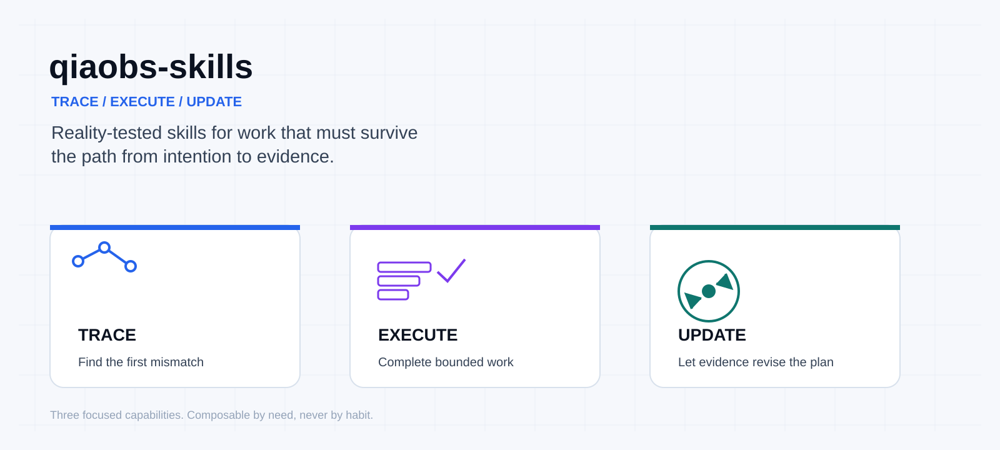

# qiaobs-skills

Three reality-tested Agent Skills for root-cause tracing, low-interaction autonomous execution, and evidence-grounded learning.

[简体中文](README.zh-CN.md)

[](https://github.com/qiao-obs/qiaobs-skills/actions/workflows/validate.yml)
[](LICENSE)
[](https://agentskills.io/)



## What this is

`qiaobs-skills` is a small, skill-only repository for agents that need to reason across messy reality instead of stopping at a plausible answer. The three skills are intentionally separate but composable:

| Skill | Solves | Trigger when | Typical output |
| --- | --- | --- | --- |
| [`trace-feature-chain`](skills/trace-feature-chain/SKILL.md) | Finds the first broken link in a feature's end-to-end chain | A role/device/entry/data condition fails, or code and release disagree | Scenario predicate, evidence matrix, root cause, minimal fix, verification and release boundary |
| [`run-autonomous-workpacks`](skills/run-autonomous-workpacks/SKILL.md) | Organizes a safe, continuous work package with fewer handoffs | The user authorizes execution across several adjacent stages | User-only blockers, ordered work, checkpoints, retries, and a truthful final state |
| [`reason-from-reality`](skills/reason-from-reality/SKILL.md) | Turns evidence-grounded principles into learning and decision loops | Planning, diagnosis, assessment, reflection, or long-term improvement needs a reality check | Fact/judgment/action/validation plan with measures, re-test rules, and unknowns |

## Why these three

They answer three different questions:

1. **Where did reality first diverge?** `trace-feature-chain`.
2. **How do we complete the authorized work without needless handoffs?** `run-autonomous-workpacks`.
3. **How do we choose actions and update beliefs without self-deception?** `reason-from-reality`.

They compose without becoming one giant instruction set. For example, use `run-autonomous-workpacks` to organize a low-interaction bug fix, and `trace-feature-chain` to locate the fault. Use `reason-from-reality` when the work package is a long-term learning or capability-building system.

## Install

List available skills:

```bash
npx skills add qiao-obs/qiaobs-skills --list
```

Install all three for Codex:

```bash
npx skills add qiao-obs/qiaobs-skills --skill trace-feature-chain -a codex
npx skills add qiao-obs/qiaobs-skills --skill run-autonomous-workpacks -a codex
npx skills add qiao-obs/qiaobs-skills --skill reason-from-reality -a codex
```

Install the whole repository when supported by your client:

```bash
npx skills add qiao-obs/qiaobs-skills -a codex
```

Manual fallback: copy only the desired `skills/<name>/` directory into the skill directory documented by your agent client. Keep `SKILL.md` and its referenced files together.

## Codex examples

**English — cross-layer debugging**

> The admin account can edit its public profile on the simulator, but the real phone fails only when an avatar URL exists. Trace the complete chain, find the first mismatch, make the smallest safe fix, and tell me exactly which build and release evidence is still missing.

**中文 — 长期备考诊断**

> 我准备一个长期考试目标。请先区分事实、判断、行动、验证和未知，不要用鼓励替代诊断；根据真实练习记录设计主动提取、间隔复习、迁移练习和复测规则。

## Compatibility

Codex is the primary target. Other clients that follow the open Agent Skills conventions are best-effort compatible; this repository does not claim complete support for any unverified platform.

## Safety and boundaries

These skills do not expand authorization. They must preserve user changes, avoid destructive history rewrites, avoid secrets and private data, and distinguish diagnosis from implementation. Public release, production changes, external messages, paid actions, data deletion, and account authentication remain explicit boundaries. A test, build, preview, upload, deployment, or user acceptance proves only its own layer.

## Origin and method

The method was distilled from the long-running development and debugging of an anonymized campus information mini-program. The public version retains the reusable method: freeze the real role, device, entry point, data shape, failure predicate, and expected result; trace the first mismatch through API, persistence, shared contracts, runtime, build, release, re-entry, and recovery; then verify with the original conditions. It intentionally excludes private logs, identifiers, credentials, infrastructure details, and real user data. See [`docs/origins-and-method.md`](docs/origins-and-method.md).

## Evaluation and quality

The repository contains deterministic structural validation, trigger datasets with near-neighbor negatives, scenario rubrics, and composition cases. CI runs static checks only; model-trigger and forward-testing evidence is versioned as an honest test plan and result record rather than fabricated scores. See [`docs/skill-engineering-notes.md`](docs/skill-engineering-notes.md) and [`evals/scenario-rubrics.md`](evals/scenario-rubrics.md).

## Contributing

Read [`CONTRIBUTING.md`](CONTRIBUTING.md), preserve the public-safe boundary, and run `python scripts/validate_skills.py` plus `python -m unittest discover -s tests -v` before opening a pull request.

## License

MIT. See [`LICENSE`](LICENSE). Acknowledgements and non-endorsement notes are in [`ACKNOWLEDGEMENTS.md`](ACKNOWLEDGEMENTS.md).
